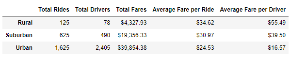

# PyBer_Analysis

## Project Overview

Perform an analyses on the ride-sharing data set aiming to understand the Total Fares by City Type by month.

Analysis key deliverables:

1. The total number of rides for each city type is retrieved
2. The total number of drivers for each city type is retrieved
3. The sum of the fares for each city type is retrieved
4. The average fare per ride for each city type is calculated
5. The average fare per driver for each city type is calculated
6. A PyBer summary DataFrame is created
7. The PyBer summary DataFrame is formatted as shown in the example

This project was fully developed in Python using Pandas and Numpy, code can be checked at the following link:

[PyBer_Challenge.ipynb](PyBer_Challenge.ipynb)

## Resources

[city_data.csv](Resources/city_data.csv)

[ride_data.csv](Resources/ride_data.csv)

## Results

The Rural city type has the lowest number of rides, drivers and total fare, but has the highest avarege fare por ride and average fare per driver. On the opposite,
the Urban city tipe has the highest number of rides, drives and total fare, and the lowest avarege fare por ride and average fare per driver. The Suburban city
type in between the two other types in all KPIs.

All city types present small increase and decreases throughout the months. It is possible to identify a peak on total fare in the sencond half of February for 
all city types. 

## Summary

* Urban city type is the main source of fares, representing 62.7% of the revenue. Additionally, it represents 80.9% of the drivers and 68.4% of rides.

* Rural city type has the highest average fare per ride and per driver.
